# Contract System Entity Relationship Diagram

## Visual Representation of Contract System Relationships

```mermaid
graph TB
    subgraph "Core Entities"
        Contract[Contract]
        User[User]
        Project[Project]
        Client[Client]
        Workspace[Workspace]
    end
    
    subgraph "Contract Components"
        ContractAmendment[ContractAmendment]
        ContractQuantity[ContractQuantity]
        ContractApproval[ContractApproval]
        ContractObligation[ContractObligation]
        JournalEntry[JournalEntry]
        EstimatesInvoice[EstimatesInvoice]
        Task[Task]
        Item[Item]
    end
    
    subgraph "Supporting Entities"
        ContractType[ContractType]
        Profession[Profession]
        Status[Status]
        Priority[Priority]
    end
    
    %% Core Contract Relationships
    Contract --> Workspace
    Contract --> Client
    Contract --> Project
    Contract --> ContractType
    Contract --> Profession
    
    %% Users to Contract Relationships
    Contract --> User[user as creator]
    Contract --> User[site_supervisor]
    Contract --> User[quantity_approver]
    Contract --> User[accountant]
    Contract --> User[reviewer]
    Contract --> User[final_approver]
    
    %% Contract Components Relationships
    ContractAmendment --> Contract
    ContractAmendment --> User[requested_by]
    ContractAmendment --> User[approved_by]
    ContractAmendment --> User[signed_by]
    
    ContractQuantity --> Contract
    ContractQuantity --> User[submitter]
    ContractQuantity --> User[approver]
    ContractQuantity --> Item
    
    ContractApproval --> Contract
    ContractApproval --> User[approver]
    
    ContractObligation --> Contract
    ContractObligation --> User[party]
    ContractObligation --> User[assigned_to]
    ContractObligation --> User[compliance_checker]
    
    JournalEntry --> Contract
    JournalEntry --> EstimatesInvoice
    JournalEntry --> User[created_by]
    JournalEntry --> User[posted_by]
    JournalEntry --> Workspace
    
    EstimatesInvoice --> Contract
    EstimatesInvoice --> Client
    EstimatesInvoice --> Workspace
    
    Task --> Contract
    Task --> Project
    Task --> User[assignee]
    Task --> Status
    Task --> Priority
    Task --> Workspace
    
    %% Many-to-many relationships
    EstimatesInvoice -.-> Item[item through pivot table]
```



## Key Relationships Summary

### One-to-Many Relationships
- Contract → ContractAmendment (one contract can have many amendments)
- Contract → ContractQuantity (one contract can have many quantities)
- Contract → ContractApproval (one contract can have many approval stages)
- Contract → ContractObligation (one contract can have many obligations)
- Contract → JournalEntry (one contract can have many journal entries)
- Contract → EstimatesInvoice (one contract can have many estimates/invoices)
- Contract → Task (one contract can have many tasks)

### Belongs-To Relationships
- ContractAmendment → Contract (each amendment belongs to one contract)
- ContractQuantity → Contract (each quantity belongs to one contract)
- ContractApproval → Contract (each approval belongs to one contract)
- ContractObligation → Contract (each obligation belongs to one contract)
- JournalEntry → Contract (each journal entry belongs to one contract)
- EstimatesInvoice → Contract (each estimate/invoice belongs to one contract)
- Task → Contract (each task can belong to one contract)

### Many-to-One with Users
- Multiple contract-related entities connect to various users in different roles
- Contract can connect to different users for different purposes (creator, supervisors, approvers)

### Cross-Entity Connections
- EstimatesInvoice connects to both Contract and Client
- ContractObligation connects to Contract and various User roles
- JournalEntry connects to Contract and EstimatesInvoice
- ContractQuantity connects to Contract and Item

## Data Flow Patterns

### Contract Execution Flow
```
Contract → ContractQuantity → ContractApproval → EstimatesInvoice → JournalEntry
```

### Task Execution Flow
```
Contract → Task → TaskTimeEntry
```

### Amendment Process Flow
```
Contract → ContractAmendment → ContractApproval → Contract update
```

### Obligation Tracking Flow
```
Contract → ContractObligation → Compliance Checks
```